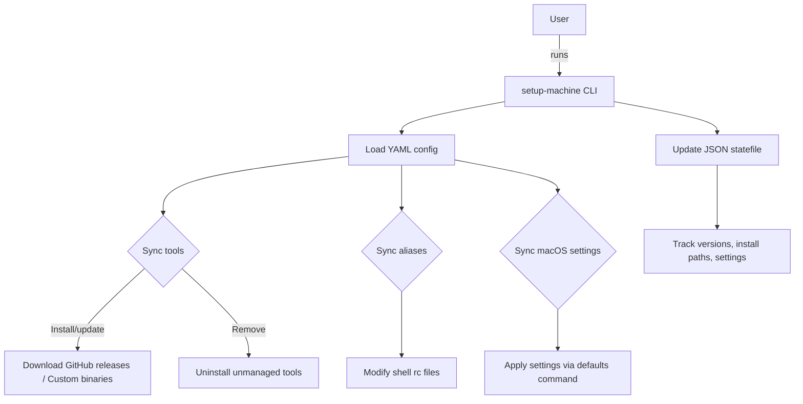

# setup-machine

> ⚙️ Automate your macOS developer environment setup with Go

[](https://golang.org)
[](https://github.com/kodelint/setup-machine/releases)

`setup-machine` is a powerful, modular, and version-aware CLI tool to automate the setup of your macOS developer environment. Written in Go, it uses a declarative YAML configuration to install CLI tools, manage shell aliases, and apply macOS system settings — all while keeping track of state for safe, idempotent operations.

---

## 🚀 Features

- 🧩 **Modular, declarative setup** via a simple YAML file
- 📦 **Install CLI tools** directly from GitHub release assets (`.zip`, `.tar.gz`, `.tgz`) or custom URLs
- 🔐 **Version enforcement** to ensure specific tool versions are installed and prevent redundant reinstallations
- 🧹 **Uninstall unmanaged tools** to keep your environment clean (optional)
- 🧠 **Track installed tools and settings** with a persistent JSON statefile
- 🐚 **Manage shell aliases** intelligently without duplication
- 🍎 **Apply macOS system settings** seamlessly using native `defaults` commands

---

## 🏗️ Architecture Overview



## 📁 Directory Structure

```Bash
├── cmd/ # CLI commands
│ ├── root.go
│ └── sync.go 
├── config/
│ ├── config.yaml # main configuration file (skel)
│ ├── tools.yaml # collection of tools to be installed
│ ├── settings.yaml # MacOS Settings collection
│ └── aliases.yaml # Shell Aliases
├── internal/
│ ├── config/ # Config loader
│ ├── installer/ # Tool installer
│ ├── logger/ # Logging utility
│ └── state/ # State management
├── config.yaml # Example configuration file
└── main.go
```

## YAML configuration
The whole configuration file has been slit into 4 different `yaml` files

- `config.yaml`
- `tools.yaml`
- `settings.yaml`
- `aliases.yaml`

```yaml
## 🧪 Example Configuration

tools:
  - name: sharkdp/bat
    version: "0.24.0"
  - name: junegunn/fzf
    version: "0.43.0"

aliases:
  shell: zsh
  entries:
    - name: g
      value: git
    - name: gs
      value: git status
    - name: glog
      value: g log --pretty=format:'%C(auto)%h%d %s %C(blue)(%cr) %C(green)<%an>' --graph --all

settings:
  - domain: com.apple.finder
    key: AppleShowAllFiles
    type: bool
    value: true
```

## 📦 Installation
Clone the repo and build:
```Bash
git clone https://github.com/yourname/setup-machine.git
cd setup-machine
go build -o setup-machine
```

## ⚙️ Usage

| Command       | Description                     |
|---------------|---------------------------------|
| sync          | install tools, aliases, setting |
| sync tools    | sync tools only                 |
| sync aliases  | sync aliases only               |
| sync settings | Apply macOS system preferences  |

## 📊 State File
State is tracked in a JSON file `state.json`:
```json
{
  "tools": {
    "bat": {
      "version": "0.24.0",
      "install_path": "/usr/local/bin/bat",
      "installed_by_dev_setup": true
    }
  },
  "settings": {
    "com.apple.finder:AppleShowAllFiles": {
      "domain": "com.apple.finder",
      "key": "AppleShowAllFiles",
      "value": "true"
    }
  }
}

```
### Why state tracking?
- Guarantees idempotency: only applies changes when necessary 
- Enables version upgrades/downgrades safely 
- Facilitates cleanup of tools no longer declared in config

## 💡 Planned Enhancements
🔜 Editor plugin setup (Vim, Neovim)  
🔜 Font installation  
🔜 GitHub auth/token support