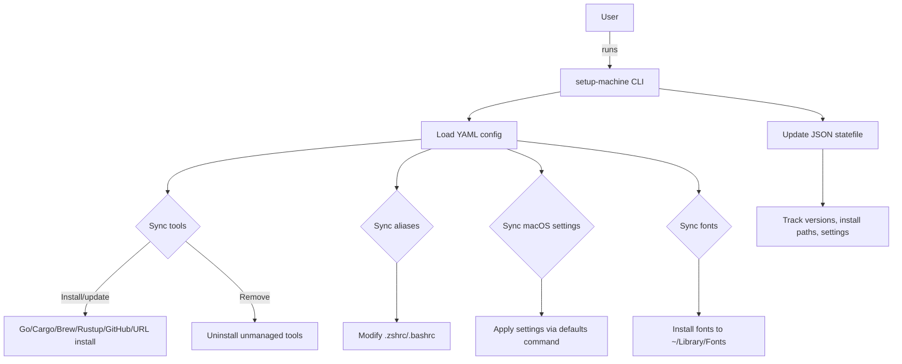

# setup-machine

> ⚙️ Automate your macOS developer environment setup with Go

[](https://golang.org)
[](https://github.com/kodelint/setup-machine/releases)
[](https://goreportcard.com/report/github.com/kodelint/setup-machine)


`setup-machine` is a powerful, modular, and version-aware CLI tool to automate the setup of your macOS developer environment. Written in Go, it uses a declarative YAML configuration to install CLI tools, manage shell aliases, and apply macOS system settings — all while keeping track of state for safe, idempotent operations.

---

## 🚀 Features

- 🧩 Modular, declarative setup via clean `YAML` configs
- 📦 Flexible tool installation from:
    - ✅ GitHub releases (`.zip`, `.tar.gz`, `.tgz`)
    - ✅ Custom direct-download URLs
    - ✅ `go install` with version enforcement
    - ✅ `cargo install` via Rust
    - ✅ `rustup component add` (auto-detects active architecture)
    - ✅ Homebrew (installs latest version)
- 🔤 Font installation from GitHub releases (only "Regular" fonts)
- 🔐 Version enforcement & binary discovery
- 🧹 Uninstall unmanaged tools and fonts with method-aware fallback logic
- 🧠 Statefile-based tracking for tools, aliases, fonts, and settings
- 🐚 Shell alias configuration with smart duplication avoidance
- 🍎 Apply macOS defaults using native `defaults` CLI

---

## 🏗️ Architecture Overview



## 📁 Directory Structure

```Bash
├── cmd/ # CLI entry points
│   ├── root.go
│   └── sync.go 
├── config/
│   ├── tools.yaml       # tools to install
│   ├── settings.yaml    # macOS preferences
│   ├── fonts.yaml       # Fonts preferences
│   └── aliases.yaml     # shell aliases/env setup
├── internal/
│   ├── config/          # config loaders
│   └── installer/       # tool installation logic
├── config.yaml          # example global config
├── main.go              # entry point
└── state.json           # statefile
```

## YAML configuration
The whole configuration file has been slit into 4 different `yaml` files

#### `config.yaml` main config file
```yaml
config:
  tools_file: "config/tools.yaml"
  settings_file: "config/settings.yaml"
  aliases_file: "config/aliases.yaml"
  fonts_file: "config/fonts.yaml"
```

#### tools.yaml`
```yaml
## 🧪 Example Configuration
tools:
  - name: sharkdp/bat
    version: "0.24.0"
    source: github

  - name: fzf
    version: "0.43.0"
    source: github

  - name: gopls
    version: "latest"
    source: go

  - name: rust-analyzer
    source: rustup

  - name: cargo-watch
    version: "8.4.0"
    source: cargo

  - name: ripgrep
    source: brew
```
#### `aliases.yaml`

```yaml
aliases:
  shell: zsh
  entries:
    - name: g
      value: git
    - name: gs
      value: git status
    - name: glog
      value: g log --pretty=format:'%C(auto)%h%d %s %C(blue)(%cr) %C(green)<%an>' --graph --all
  raw_configs:
    - export PATH="$HOME/.cargo/bin:$PATH"
    - eval "$(starship init zsh)"
```
#### `settings.yaml`
```yaml
settings:
  - domain: com.apple.finder
    key: AppleShowAllFiles
    type: bool
    value: true
```

#### `fonts.yaml`
```yaml
fonts:
  - name: 0xProto
    version: "2.304"
    source: github
    repo: ryanoasis/nerd-fonts
    tag: v3.4.0
```
(Note: Only `.ttf` and `.otf` font files containing **"Regular/regular"** in the name are installed into `~/Library/Fonts`.)

## 📦 Installation
Clone the repo and build:
```Bash
git clone https://github.com/yourname/setup-machine.git
cd setup-machine
go build -o setup-machine
```

## ⚙️ Usage

| Command       | Description                     |
|---------------|---------------------------------|
| sync          | install tools, aliases, setting |
| sync tools    | sync tools only                 |
| sync aliases  | sync aliases only               |
| sync settings | Apply macOS system preferences  |

## 📊 State File
State is tracked in a JSON file `state.json`:
```json
{
  "tools": {
    "bat": {
      "version": "0.24.0",
      "install_path": "/usr/local/bin/bat",
      "installed_by_dev_setup": true
    },
    "rust-analyzer": {
      "version": "0.10.1",
      "install_path": "/Users/roy/.cargo/bin/rust-analyzer",
      "installed_by_dev_setup": true
    }
  },
  "settings": {
    "com.apple.finder:AppleShowAllFiles": {
      "domain": "com.apple.finder",
      "key": "AppleShowAllFiles",
      "value": "true"
    }
  }
}
```
### Why state tracking?
- 💡 Guarantees idempotency
- 💡 Enables safe upgrades/downgrades
- 💡 Allows tool cleanup when removed from config
- 💡 Avoids duplicate alias lines
- 💡 Prevents re-applying unchanged settings

## 📍 Roadmap
- [x] `GitHub` + `Go` + `Rust` + `Brew` tool install
- [x] Font install with version/state tracking
- [x] Shell alias syncing and deduplication
- [x] macOS settings via defaults
- [ ] Editor plugin sync (Neovim, Helix, etc.)